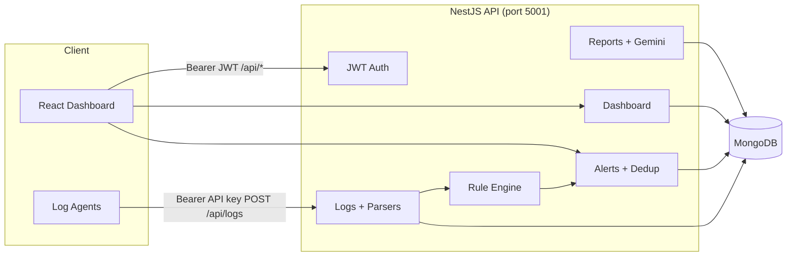

# SmartSIEM

SmartSIEM is an intelligent **Security Information and Event Management (SIEM)** platform. It ingests security logs from distributed agents, normalizes them into a common schema, runs real-time detection rules, and surfaces alerts, dashboards, and AI-enriched reports through a modern web console.

---

## Table of Contents

1. [Project Overview & Purpose](#1-project-overview--purpose)
2. [System Architecture & Tech Stack](#2-system-architecture--tech-stack)
3. [Core Features & Functionalities](#3-core-features--functionalities)
4. [Key Workflows](#4-key-workflows)
5. [Current Status & Strengths](#5-current-status--strengths)
6. [Future Scalability & Next Steps](#6-future-scalability--next-steps)
7. [Project Structure](#project-structure)
8. [Getting Started](#getting-started)
9. [API Overview](#api-overview)
10. [Detection Rules](#detection-rules)
11. [Configuration](#configuration)
12. [License](#license)

---

## 1. Project Overview & Purpose

### What is this system?

SmartSIEM collects, stores, and analyzes security events (authentication failures, web attacks, API abuse, reconnaissance, network anomalies) and turns them into **actionable alerts** with context, recommendations, and reporting.

### What core problem does it solve?

Security teams are overwhelmed by raw logs from many sources. Manual correlation is slow and error-prone. SmartSIEM addresses this by:

- **Centralizing** log ingestion via API-key–authenticated agents
- **Normalizing** heterogeneous formats (JSON, Nginx, Syslog) into one event model
- **Detecting** threats automatically with 16 built-in rules
- **Reducing noise** through alert deduplication and severity rollups
- **Accelerating response** with enrichment (geo, IP reputation, user risk) and recommendations
- **Summarizing** incidents in daily Markdown reports (optionally enriched by Google Gemini)

### Who is the end-user?

| Role                    | Description                                                                                         |
| ----------------------- | --------------------------------------------------------------------------------------------------- |
| **Security analyst**    | Primary operator: monitors dashboard, triages alerts, manages logs, runs reports, configures agents |
| **Administrator**       | Manages users, audit trail, global visibility across tenants, admin console                         |
| **Integration / agent** | Automated log forwarder using a per-user API key (`POST /api/logs`)                                 |

---

## 2. System Architecture & Tech Stack

### Architecture diagram



### Tech stack

| Layer        | Technologies                                                                         |
| ------------ | ------------------------------------------------------------------------------------ |
| **Frontend** | React 19, TypeScript, Vite, Tailwind CSS, Recharts, Radix UI                         |
| **Backend**  | NestJS 10, TypeScript, `@nestjs/mongoose`, `@nestjs/jwt`, `@nestjs/schedule`         |
| **Database** | MongoDB (Mongoose ODM)                                                               |
| **AI**       | Google GenAI (`@google/genai`, model `gemini-2.5-flash`) for daily report enrichment |
| **Auth**     | JWT access + refresh tokens, scrypt password hashing, role-based guards              |

### How the layers interact

1. **Frontend** (`frontend/`) runs on Vite (default port `3001`). In development, `/api` is proxied to the NestJS backend (`vite.config.ts` reads `BACKEND_HOST` / `BACKEND_PORT` from the parent `.env`).

2. **Backend** (`Backend/`) exposes REST APIs under the global prefix `/api`. It connects to MongoDB on startup and loads detection rules from an in-code registry.

3. **Data layer** stores normalized logs and alerts in MongoDB collections with indexes for IP, user, timestamp, and multi-tenant `userId` / `agentId` scoping.

4. **Agents** bypass user JWT for ingestion only: they authenticate with `Authorization: Bearer <agent-api-key>` on `POST /api/logs`. The resolved agent attaches `userId` and `agentId` to every stored event.

---

## 3. Core Features & Functionalities

### Authentication & access control

- User registration and login (`/api/auth/*`)
- JWT access and refresh tokens with session tracking
- Roles: `security_analyst`, `admin`
- Account lockout after repeated failed logins
- Bootstrap admin created when the database is empty
- Page-level RBAC in the React app (admin-only Admin Console)

### Log collection & parsing

- **Ingestion:** `POST /api/logs` (agent API key)
- **Parsers:** Nginx combined log lines, Syslog (RFC5424 / RFC3164), generic structured JSON
- **Normalization:** Unified schema (`event_id`, `timestamp`, `source`, `severity`, `event`, `message`, `ip`, geo fields, etc.)
- **Management:** List, delete single log, clear logs (tenant-scoped)

### Detection engine

- **16 detection rules** across authentication, web attacks, API abuse, reconnaissance, and network categories
- Rules evaluated **synchronously on each ingested log**
- Per-rule enable/disable via API
- Historical correlation using MongoDB queries (sliding windows, counts, geo distance)

### Alerts

- Auto-created when rules fire
- **Deduplication** (default 5-minute window per user + rule + IP + agent)
- **Enrichment:** IP reputation heuristics, geolocation, prior alerts from IP, user risk score
- **Recommendations** attached per rule type
- Status workflow: `open` → `investigating` → `resolved` (or `false_positive`)

### Dashboard & visualization

- KPI cards: logs today, active alerts, critical threats, system health score
- Charts: log activity (6 buckets), alerts by severity, events by source
- Geographic attack map (lat/lng projection from logs/alerts)
- Live terminal-style event stream
- Recent alerts table with deep-dive modal

### Agents

- Per-user collector agents with hashed API keys
- One-time or encrypted stored key modes
- Regenerate and reveal API key endpoints

### Reports

- Daily Markdown security reports (last 24 hours of alerts)
- Optional **Gemini AI** section: executive summary, admin actions, developer fixes
- Scheduled generation (cron: daily at 7 AM) per tenant with recent alerts
- PDF export from the frontend

### Alert assistant

- Floating chatbot on authenticated pages
- Rule-based triage helper (`POST /api/alert-assistant/chat`) — matches alerts and returns recommendations (not a full LLM chat)

### Admin console

- System overview, user management, audit log, agent listing (admin role)

### Threat intelligence

- Configurable malicious IP blocklist (`MALICIOUS_IPS`)
- Demo TEST-NET IPs for lab use (disable with `MALICIOUS_IP_INCLUDE_DEMO=false`)

### System health

- `GET /api/system/status` — MongoDB connection, ingestion rate (EPS), active/critical alert counts

---

## 4. Key Workflows

### Workflow A: Log ingestion → detection → alert

```
Agent                    Backend                         MongoDB
  |                         |                               |
  |-- POST /api/logs ------>|                               |
  |   Bearer <api-key>      |                               |
  |                         |-- resolve agent (userId)      |
  |                         |-- normalize (parser chain)    |
  |                         |-- insert log(s) ------------->|
  |                         |-- rule engine (16 rules)      |
  |                         |   (query history in DB)       |
  |                         |-- emitAlert if match          |
  |                         |-- dedup merge/create alert -->|
  |<-- 201 + log doc -------|                               |
```

**Parser order** (first match wins): Nginx → Syslog → Generic fallback.

**Example ingest payload:**

```json
{
  "timestamp": "2026-02-09T19:00:00.000Z",
  "source": "auth-service",
  "severity": "high",
  "event": "login_failed",
  "user": "alice",
  "ip": "203.0.113.10"
}
```

**Example alert output** (after repeated failures from the same IP):

```json
{
  "rule_id": "failed-logins-5-in-5m",
  "message": "Brute-force pattern from IP 203.0.113.10: 5 failed logins in 15m (burst)",
  "severity": "high",
  "ip": "203.0.113.10",
  "status": "open",
  "occurrenceCount": 4,
  "context": {
    "recommendations": [
      "Temporarily lock the user account",
      "Block the source IP address",
      "Enable CAPTCHA on login"
    ]
  }
}
```

### Workflow B: Analyst login → dashboard monitoring

```
Browser                  Vite proxy              NestJS                 MongoDB
  |                         |                      |                      |
  |-- POST /api/auth/login->|--------------------->| validate user        |
  |<-- access + refresh ----|                      |                      |
  |                         |                      |                      |
  |-- GET /api/dashboard/kpi (poll 1s) ---------->| aggregate counts --->|
  |-- GET /api/dashboard/summary (10s) ---------->| charts + metrics --->|
  |-- GET /api/alerts --------------------------->| list alerts -------->|
  |-- GET /api/logs ----------------------------->| list logs ---------->|
```

The analyst reviews KPIs, charts, and the geographic map; opens **Alerts & Threats** to change status via `PATCH /api/alerts/:id/status`; uses the alert assistant chatbot for triage hints.

---

## 5. Current Status & Strengths

### What works well today

| Area                    | Highlight                                                                        |
| ----------------------- | -------------------------------------------------------------------------------- |
| **End-to-end pipeline** | Ingest → normalize → detect → alert → UI is fully wired                          |
| **Rule coverage**       | 16 production-style rules (brute force, SQLi, XSS, impossible travel, DoS, etc.) |
| **Multi-tenancy**       | Logs and alerts scoped by `userId`; admins see all data                          |
| **Alert quality**       | Dedup, occurrence counts, enrichment, and rule-specific recommendations          |
| **Log flexibility**     | JSON, Nginx, and Syslog parsers with unit tests                                  |
| **UX**                  | Polished dark SOC-style dashboard with live KPI polling                          |
| **Reporting**           | Markdown daily reports + optional Gemini executive insights                      |
| **Security basics**     | JWT sessions, role guards, agent API key hashing, account lockout                |

### Implementation highlights

- **Modular rule registry** — each rule is a separate file under `Backend/src/rules/definitions/`
- **Pluggable parsers** — easy to add new log formats via `LOG_PARSERS` factory
- **Recommendation engine** — parallel structure to rules for consistent playbooks
- **Indexed MongoDB schemas** — optimized for IP, user, event, and time-range queries

### Known limitations

- Root-level docs previously referenced Python; the **active stack is TypeScript only** (NestJS + React).
- `frontend/src/lib/smartsiemApi.ts` defines types for a separate worker/collector/Kafka pipeline — **not used** by the main UI, which talks to NestJS `/api/*`.
- Alert assistant is **heuristic**, not Gemini-powered.
- Geographic map is a **schematic 2D projection**, not a tile-based world map.

---

## 6. Future Scalability & Next Steps

### Scalability

| Direction                          | Rationale                                                         |
| ---------------------------------- | ----------------------------------------------------------------- |
| **Message queue (Kafka/RabbitMQ)** | Decouple ingestion from rule evaluation for high EPS              |
| **Horizontal API scaling**         | Stateless NestJS instances behind a load balancer                 |
| **MongoDB sharding / time-series** | Partition logs by `timestamp` for retention and query performance |
| **Dedicated rule worker**          | Async rule evaluation to avoid blocking ingest responses          |
| **Rate limiting & backpressure**   | Protect API from agent floods                                     |

### Feature enhancements

- **Custom rules UI** — create/edit rules without code deploys
- **Webhook / email / Slack notifications** on critical alerts
- **SIEM integrations** — export to Splunk, Elastic, or STIX/TAXII feeds
- **Full LLM alert assistant** — Gemini/OpenAI for natural-language investigation
- **Real map tiles** — Mapbox/Leaflet for geographic visualization
- **WebSocket live stream** — push alerts to dashboard (client stub exists in `websocket.ts`)
- **Retention policies** — automated log/archive lifecycle
- **SSO / OIDC** — enterprise identity providers
- **`.env.example`** — documented template for all configuration keys

### Operational maturity

- Docker Compose for MongoDB + backend + frontend
- CI pipeline (lint, `parsers.unit-test.ts`, build)
- OpenAPI/Swagger documentation for `/api`
- Structured logging and metrics (Prometheus/Grafana)

---

## Project Structure

```
SmartSIEM/
├── Backend/                 # NestJS API
│   └── src/
│       ├── logs/            # Ingestion, parsers, schemas
│       ├── rules/           # Detection rules + engine
│       ├── alerts/          # Alerts, dedup, geo enrichment
│       ├── dashboard/       # KPI & chart aggregations
│       ├── agents/          # API key agents
│       ├── auth/            # Users, JWT, sessions
│       ├── reports/         # Daily reports + Gemini AI
│       ├── alert-assistant/ # Triage chatbot
│       ├── recommendations/ # Rule playbooks
│       ├── threat-intel/    # Malicious IP list
│       ├── admin/           # Admin APIs
│       └── geo/             # IP geolocation
├── frontend/                # React + Vite dashboard
│   └── src/app/
│       ├── components/      # Pages (Dashboard, Alerts, Logs, …)
│       ├── api/             # REST clients
│       └── features/admin/  # Admin console
├── reports/                 # Generated daily .md reports (runtime)
└── README.md                # This file
```

---

## Getting Started

### Prerequisites

- **Node.js** 18+ (20 recommended)
- **MongoDB** 6+ running locally or remotely
- **npm**

### 1. Configure environment

Create `SmartSIEM/.env` (loaded by both Backend and Vite):

```env
MONGODB_URI=mongodb://localhost:27017/smart-siem
PORT=5001
JWT_ACCESS_SECRET=change-me-access
JWT_REFRESH_SECRET=change-me-refresh
BOOTSTRAP_ADMIN_USERNAME=admin
BOOTSTRAP_ADMIN_PASSWORD=ChangeMe!123

# Optional: AI daily report enrichment
GEMINI_API_KEY=

# Optional: threat intel
MALICIOUS_IPS=203.0.113.10,198.51.100.50

# Frontend dev proxy
BACKEND_HOST=localhost
BACKEND_PORT=5001
FRONTEND_PORT=3001
```

### 2. Start the backend

```bash
cd Backend
npm install
npm run start:dev
```

API base: `http://localhost:5001/api`

### 3. Start the frontend

```bash
cd frontend
npm install
npm run dev
```

UI: `http://localhost:3001`

### 4. Create an agent and send a test log

1. Log in to the UI (default bootstrap admin if the database is empty).
2. Open **Access Control** (or agent settings) and create an agent; copy the API key.
3. Ingest a log:

```bash
curl -X POST http://localhost:5001/api/logs \
  -H "Authorization: Bearer YOUR_AGENT_API_KEY" \
  -H "Content-Type: application/json" \
  -d "{\"timestamp\":\"2026-05-23T10:00:00Z\",\"source\":\"auth-service\",\"event\":\"login_failed\",\"user\":\"admin\",\"ip\":\"203.0.113.10\",\"severity\":\"high\"}"
```

Repeat several times from the same IP within a few minutes to trigger the brute-force detection rule.

### 5. Run parser unit tests

```bash
cd Backend
npm test
```

---

## API Overview

| Method | Endpoint                 | Auth          | Description                |
| ------ | ------------------------ | ------------- | -------------------------- |
| POST   | `/api/auth/login`        | Public        | Obtain JWT                 |
| POST   | `/api/auth/register`     | Public        | Register user              |
| POST   | `/api/logs`              | Agent API key | Ingest logs                |
| GET    | `/api/logs`              | Analyst JWT   | List recent logs           |
| GET    | `/api/alerts`            | Analyst JWT   | List alerts                |
| PATCH  | `/api/alerts/:id/status` | Analyst JWT   | Update alert status        |
| GET    | `/api/dashboard/summary` | Analyst JWT   | Dashboard metrics + charts |
| GET    | `/api/dashboard/kpi`     | Analyst JWT   | KPI-only (fast poll)       |
| GET    | `/api/rules`             | Analyst JWT   | List rules + stats         |
| PUT    | `/api/rules/:id/toggle`  | Analyst JWT   | Enable/disable rule        |
| POST   | `/api/agents`            | JWT           | Create agent               |
| POST   | `/api/reports/daily`     | Analyst JWT   | Generate daily report      |
| GET    | `/api/system/status`     | Public        | Health / EPS / DB status   |
| GET    | `/api/admin/*`           | Admin JWT     | Admin console APIs         |

---

## Detection Rules

| ID                             | Category       | Summary                                 |
| ------------------------------ | -------------- | --------------------------------------- |
| `failed-logins-5-in-5m`        | Authentication | Brute-force (rapid / burst / sustained) |
| `impossible-traveler`          | Authentication | Impossible geo distance between logins  |
| `impossible-travel-country-ip` | Authentication | Country change via IP geolocation       |
| `login-after-failures`         | Authentication | Success after multiple failures         |
| `credential-stuffing`          | Authentication | Many users, one IP                      |
| `distributed-brute-force`      | Authentication | Many IPs, one target                    |
| `sql-injection-attempt`        | Web            | SQLi patterns in body or labeled events |
| `xss-attempt`                  | Web            | XSS patterns                            |
| `command-injection-attempt`    | Web            | Command injection                       |
| `api-rate-limit`               | API abuse      | Excessive API volume                    |
| `unauthorized-endpoint`        | API abuse      | Forbidden endpoint access               |
| `directory-scan`               | Reconnaissance | Path enumeration                        |
| `sensitive-file-access`        | Reconnaissance | Sensitive file paths                    |
| `known-malicious-ip`           | Network        | Blocklisted IPs                         |
| `dos-high-volume-ip`           | Network        | High request volume                     |
| `error-burst-ip`               | Network        | Burst of HTTP errors                    |

Tune thresholds in `Backend/src/rules/rules.constants.ts`.

---

## Configuration

| Variable                          | Default              | Description                             |
| --------------------------------- | -------------------- | --------------------------------------- |
| `MONGODB_URI`                     | —                    | **Required.** MongoDB connection string |
| `PORT`                            | `5001`               | Backend HTTP port                       |
| `JWT_ACCESS_SECRET`               | `change-me-access`   | Access token signing secret             |
| `JWT_REFRESH_SECRET`              | `change-me-refresh`  | Refresh token signing secret            |
| `JWT_ACCESS_TTL_SEC`              | `900`                | Access token lifetime (seconds)         |
| `JWT_REFRESH_TTL_SEC`             | `604800`             | Refresh token lifetime (seconds)        |
| `BOOTSTRAP_ADMIN_USERNAME`        | `admin`              | First-run admin username                |
| `BOOTSTRAP_ADMIN_PASSWORD`        | `ChangeMe!123`       | First-run admin password                |
| `AUTH_MAX_FAILED_ATTEMPTS`        | `5`                  | Lockout threshold                       |
| `AUTH_LOCKOUT_MINUTES`            | `15`                 | Lockout duration                        |
| `GEMINI_API_KEY`                  | —                    | Enables AI report enrichment            |
| `MALICIOUS_IPS`                   | —                    | Comma-separated blocklist               |
| `MALICIOUS_IP_INCLUDE_DEMO`       | `true`               | Include RFC 5737 demo IPs               |
| `AGENT_API_KEY_ENCRYPTION_SECRET` | —                    | Encrypt stored agent keys               |
| `BACKEND_HOST` / `BACKEND_PORT`   | `localhost` / `5001` | Vite dev proxy target                   |
| `FRONTEND_PORT`                   | `3001`               | Vite dev server port                    |

---

## License

This project is licensed under the **MIT License**.

## Contact

For questions or contributions, see the repository maintainer on GitHub.

